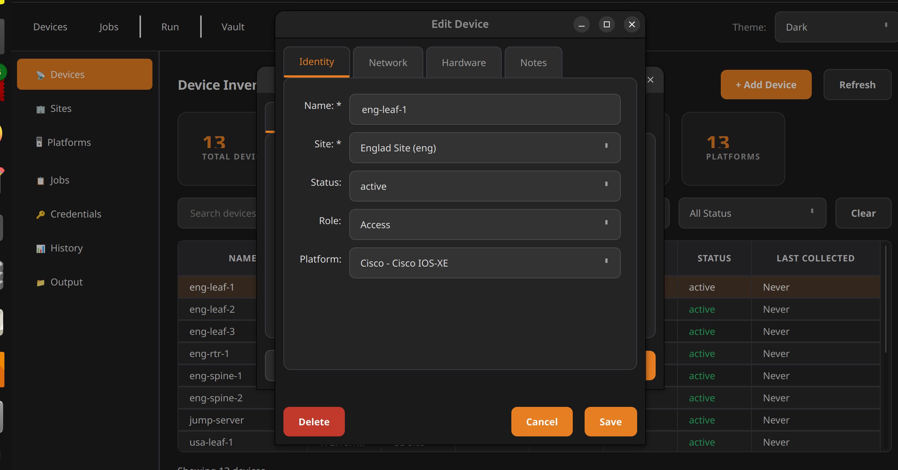
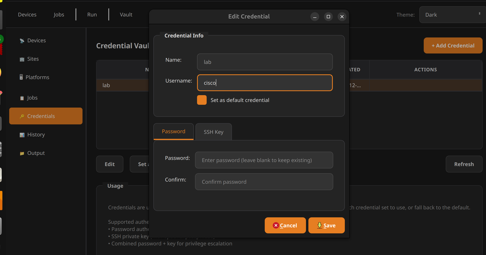
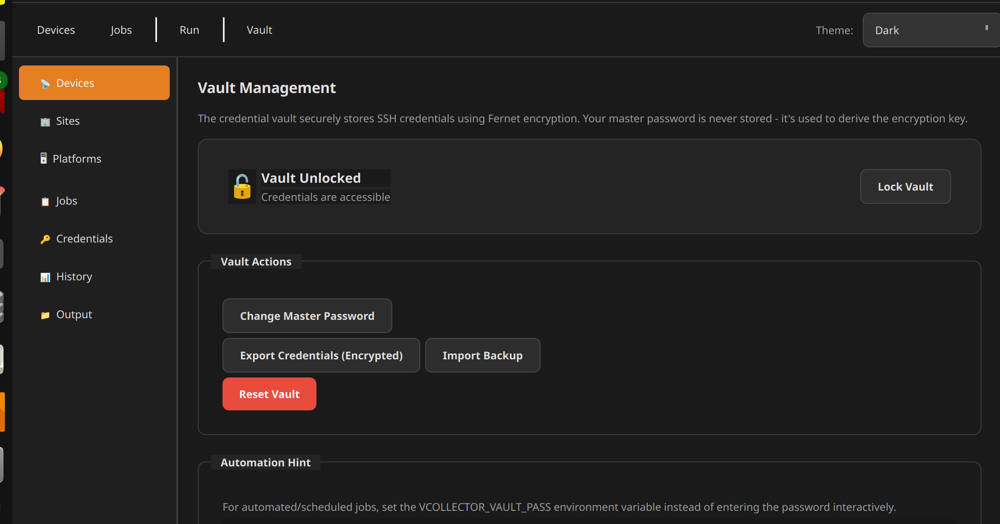
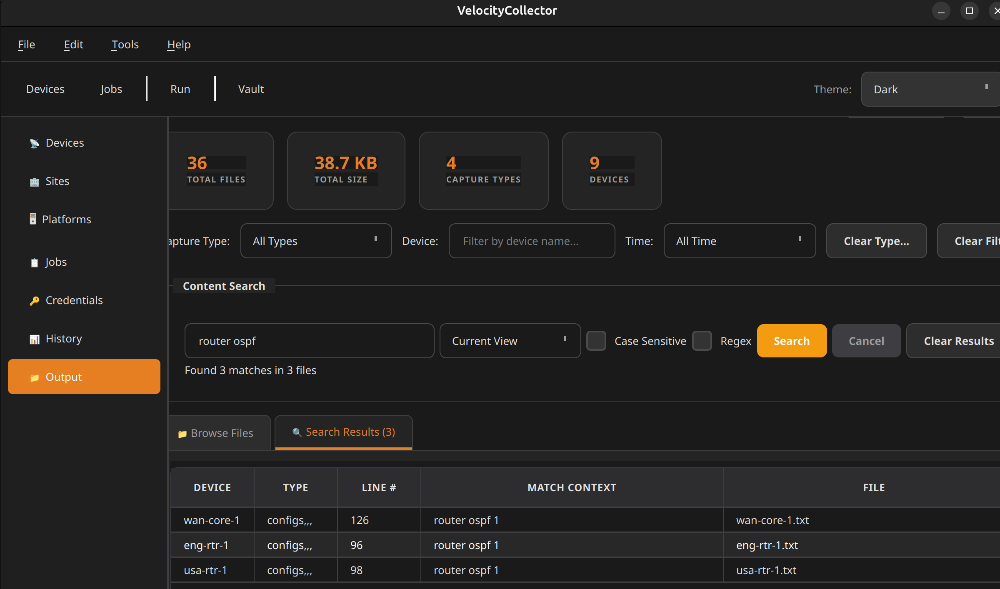
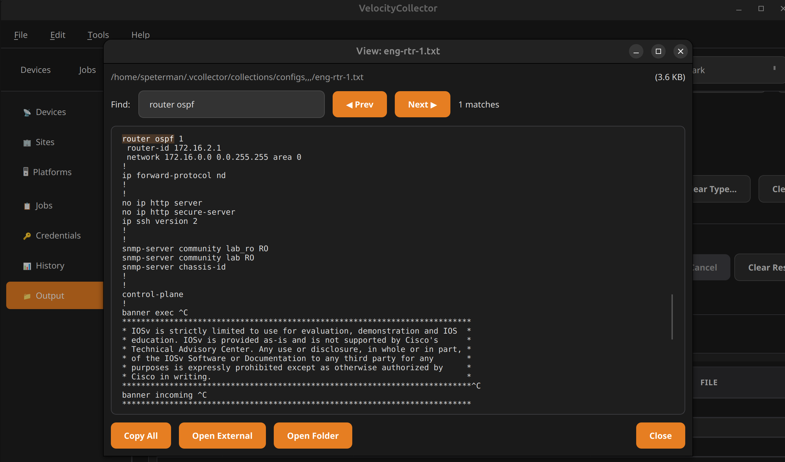
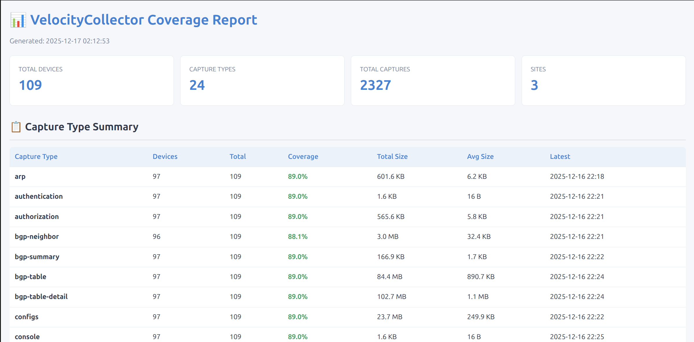

# VelocityCollector

A PyQt6 desktop application for structured network device data collection. Combines device inventory management, encrypted credential storage, and job-based collection execution in a single, pip-installable tool.

## Why VelocityCollector?

Network engineers need to collect operational data from devices—configs, routing tables, ARP caches, interface status, hardware inventory. The options aren't great:

- **Ad-hoc scripts** work but scatter logic across files, hardcode credentials, and lack structure
- **Ansible/Salt/Nornir** require infrastructure, inventory files, and operational overhead
- **Commercial tools** cost money and often don't fit the workflow

VelocityCollector provides:

- **Zero infrastructure** — Desktop app with SQLite databases, no servers required
- **Structured job definitions** — Repeatable, version-controlled collection tasks
- **Encrypted credential vault** — Fernet/PBKDF2 encryption, credentials never touch disk unencrypted
- **Per-device credentials** — Automatic discovery and assignment of working credentials
- **NetBox-compatible inventory** — Familiar data model, optional sync capability
- **Vendor-neutral collection** — SSH-based, platform-aware command execution
- **TextFSM validation** — Structured output parsing with quality scoring
- **Content search** — Regex-powered search across all collected outputs

## Screenshots

### Device Inventory

*Device editing with Identity, Network, Credentials, Hardware, and Notes tabs*

### Credential Vault

*Credential management with password and SSH key support*

### Vault Management

*Vault actions: change password, export/import, automation hints*

### Output Browser & Search

*Content search with regex support across all captured files*


*File viewer with match highlighting and navigation*

### TextFSM Template Tools

*Template development with live parsing results*


*Full CRUD for TextFSM templates with NTC import*

### Coverage Report

*HTML coverage report showing collection statistics*

## Architecture

```
┌─────────────────────────────────────────────────────────────────┐
│                        PyQt6 GUI                                │
│  ┌──────────┬──────────┬──────────┬──────────┬──────────┐      │
│  │ Devices  │  Sites   │   Jobs   │   Run    │  Vault   │      │
│  │          │Platforms │Credentials│  History │  Output  │      │
│  └──────────┴──────────┴──────────┴──────────┴──────────┘      │
└─────────────────────────────────────────────────────────────────┘
         │                    │                    │
         ▼                    ▼                    ▼
┌─────────────────┐  ┌─────────────────┐  ┌─────────────────┐
│   DCIM Module   │  │ Collection Eng. │  │  Vault Module   │
│                 │  │                 │  │                 │
│  • Sites        │  │  • JobRunner    │  │  • Credentials  │
│  • Devices      │  │  • BatchRunner  │  │  • Encryption   │
│  • Platforms    │  │  • SSHExecutor  │  │  • Key Derivation│
│  • Roles        │  │  • Validation   │  │  • Export/Import│
│  • Manufacturers│  │  • TextFSM      │  │  • Discovery    │
└────────┬────────┘  └────────┬────────┘  └────────┬────────┘
         │                    │                    │
         ▼                    ▼                    ▼
┌─────────────────┐  ┌─────────────────┐  ┌─────────────────┐
│    dcim.db      │  │  collector.db   │  │  collector.db   │
│                 │  │                 │  │   (encrypted)   │
│  NetBox-style   │  │  • jobs         │  │                 │
│  inventory      │  │  • job_history  │  │  • credentials  │
│  + cred mapping │  │  • captures     │  │  • vault_meta   │
└─────────────────┘  └─────────────────┘  └─────────────────┘
```

### Database Design

**dcim.db** — Device inventory (NetBox-compatible schema)
- `dcim_device` — Network devices with management IPs, platform, role, site, **credential mapping**
- `dcim_site` — Physical locations with timezone, status, facility info
- `dcim_platform` — OS/software platforms with netmiko device type mappings
- `dcim_device_role` — Functional roles (router, switch, firewall) with colors
- `dcim_manufacturer` — Hardware vendors

**collector.db** — Collection operations and credentials
- `credentials` — Encrypted SSH credentials (password and/or SSH key)
- `vault_metadata` — Encryption salt and password verification hash
- `jobs` — Collection job definitions (capture type, commands, filters, validation)
- `job_commands` — Multi-command job sequences
- `job_tags` — Job categorization with colors
- `job_history` — Execution records with success/failure counts
- `captures` — Output file metadata and validation scores

## Features

### Device Inventory (DCIM) ✅

NetBox-inspired data model for organizing network devices:

| Feature | Status | Description |
|---------|--------|-------------|
| **Devices** | ✅ Complete | Full CRUD, search, filters (site/platform/status/creds), tabbed edit dialog |
| **Sites** | ✅ Complete | Full CRUD, status filter, timezone dropdown, device counts |
| **Platforms** | ✅ Complete | Tabbed view with Roles, netmiko device type dropdown |
| **Roles** | ✅ Complete | Color picker, device count warnings on delete |
| **Manufacturers** | ✅ Complete | Auto-created from platforms, linked to devices |

All views include:
- Stat cards with live counts
- Search with 300ms debounce
- Sortable tables with context menus
- Keyboard shortcuts (Ctrl+N, Enter, Delete, F5)
- Cascade delete warnings

### Credential Vault ✅

Secure credential storage with defense-in-depth:

- **Master password** unlocks vault session
- **PBKDF2 key derivation** (480,000 iterations, SHA-256)
- **Fernet symmetric encryption** for stored secrets
- **In-memory only** — Decrypted credentials never written to disk
- **Default credential** — Automatic selection for job execution
- **Export/Import** — Encrypted backup and restore
- **Automation support** — `VCOLLECTOR_VAULT_PASS` environment variable for scheduled jobs

Supported credential types:
- Username/password authentication
- SSH private key (with optional passphrase)
- Combined password + key for privilege escalation

### Per-Device Credentials ✅ NEW

Network environments often have fragmented credentials — legacy devices, acquisitions, different teams. VelocityCollector supports automatic credential discovery and per-device assignment:

| Feature | Status | Description |
|---------|--------|-------------|
| **Credential Discovery** | ✅ Complete | Bulk test all vault credentials against devices |
| **Per-Device Assignment** | ✅ Complete | Store working credential per device |
| **Coverage Tracking** | ✅ Complete | Stat card shows credential coverage percentage |
| **Status Column** | ✅ Complete | Devices view shows ✓ OK / ✗ Failed / — Untested |
| **Credential Filter** | ✅ Complete | Filter devices by credential status |
| **Test Button** | ✅ Complete | Test credential from device detail/edit dialogs |
| **Credential Dropdown** | ✅ Complete | Select credential in device edit dialog |
| **Auto-Use in Jobs** | ✅ Complete | Runner automatically uses per-device credentials |

**Credential Resolution Chain:**
1. Device credential (`device.credential_id`) — from discovery
2. CLI credential (`--credential <name>`) — explicit override  
3. Default credential — vault default

### Job System ✅

Jobs define what data to collect and from which devices. Jobs are stored in the database with full GUI and CLI management:

| Feature | Status | Description |
|---------|--------|-------------|
| **Job CRUD** | ✅ Complete | Create, edit, duplicate, enable/disable, delete |
| **Job Storage** | ✅ Complete | SQLite database with migration from legacy JSON |
| **Device Filters** | ✅ Complete | By vendor, site, role, platform, name pattern, status |
| **Multi-Command Jobs** | ✅ Complete | Sequenced commands via job_commands table |
| **Job Tags** | ✅ Complete | Categorization with colors |
| **TextFSM Validation** | ✅ Complete | Template matching, quality scoring |
| **Execution Options** | ✅ Complete | Workers, timeout, inter-command delay |

### Collection Engine ✅

Multi-threaded SSH execution with per-device credential support:

| Feature | Status | Description |
|---------|--------|-------------|
| **JobRunner** | ✅ Complete | Single job execution with progress callbacks |
| **BatchRunner** | ✅ Complete | Parallel job execution |
| **SSHExecutorPool** | ✅ Complete | Concurrent device connections |
| **Per-Device Creds** | ✅ Complete | Automatic credential selection per device |
| **Dual Source** | ✅ Complete | Load jobs from database (by slug/ID) or JSON files |
| **History Recording** | ✅ Complete | Automatic job_history entries |
| **Output Validation** | ✅ Complete | TextFSM parsing with score threshold |

### Output Browser ✅

Full-featured captured data browser:

| Feature | Status | Description |
|---------|--------|-------------|
| **File Browser** | ✅ Complete | Navigate collections by capture type, device, time |
| **Content Search** | ✅ Complete | Search across all captured files |
| **Regex Support** | ✅ Complete | Pattern matching with case sensitivity toggle |
| **Search Results** | ✅ Complete | Shows device, type, line number, match context |
| **File Viewer** | ✅ Complete | Full file view with Find/Prev/Next navigation |
| **External Tools** | ✅ Complete | Copy All, Open External Editor, Open Folder |

### TextFSM Tools ✅

Integrated template development and testing:

| Feature | Status | Description |
|---------|--------|-------------|
| **Database Test** | ✅ Complete | Test output against all matching templates, auto-scoring |
| **Manual Test** | ✅ Complete | Direct template development without database |
| **Template Manager** | ✅ Complete | Full CRUD, search, preview |
| **NTC Import** | ✅ Complete | Bulk import from ntc-templates directory |
| **Export** | ✅ Complete | Export templates to .textfsm files |
| **Scoring Algorithm** | ✅ Complete | Multi-factor scoring (records, fields, population, consistency) |

Access via **Tools → TextFSM Tester** or run standalone.

### Coverage Reporting ✅

HTML coverage report generation:

```bash
python coverage_report.py
```

Generates `coverage_report.html` showing:
- Total devices, capture types, captures, sites
- Per-capture-type statistics (devices, coverage %, size, timestamps)
- Collection health metrics

### GUI Views

| View | Status | Description |
|------|--------|-------------|
| **Devices** | ✅ Complete | Full CRUD, filters, credential status column, discovery button |
| **Sites** | ✅ Complete | Full CRUD, timezone, status filter |
| **Platforms** | ✅ Complete | Tabbed with Roles, netmiko dropdown |
| **Jobs** | ✅ Complete | Full CRUD, capture type/vendor filters |
| **Run** | ✅ Complete | Job execution with per-device creds, real-time progress |
| **Credentials** | ✅ Complete | Add/edit/delete, password + SSH key, default selection |
| **Vault** | ✅ Complete | Lock/unlock, change password, export/import, reset |
| **History** | ✅ Complete | Job execution history browser |
| **Output** | ✅ Complete | File browser with content search and viewer |

## Installation

```bash
# From source
git clone https://github.com/scottpeterman/velocitycollector.git
cd velocitycollector
pip install -e .

# Run GUI
vcollector

# Or run as module
python -m vcollector
```

### Requirements

- Python 3.10+
- PyQt6
- netmiko
- textfsm
- cryptography
- pyyaml

## Quick Start

### 1. Initialize Environment

Bootstrap the directory structure and databases:

```bash
vcollector init
```

This creates:
- `~/.vcollector/` directory structure
- `config.yaml` with defaults
- `dcim.db` with schema and default platforms/roles
- `collector.db` with jobs, credentials, history schema
- `tfsm_templates.db` for TextFSM templates

### 2. Initialize the Vault

Set up encryption for credential storage:

```bash
vcollector vault init
Enter master password: ••••••••••••
Confirm master password: ••••••••••••
✓ Vault initialized successfully
```

### 3. Add Credentials

```bash
# CLI
vcollector vault add lab --username admin
vcollector vault add legacy --username netops

# Or via GUI: Credentials → + Add Credential
```

### 4. Add Devices

**Option A: Import from VelocityCMDB**

```bash
python import_from_velocitycmdb.py
```

**Option B: Import from CSV**

```csv
name,primary_ip4,platform,site,role,status
spine-1,172.16.1.1,arista_eos,dc1,spine,active
leaf-1,172.16.10.1,arista_eos,dc1,leaf,active
core-1,172.16.2.1,cisco_ios,dc1,router,active
```

**Option C: GUI**

Navigate to **Devices** → **+ Add Device**

### 5. Discover Credentials

Test all vault credentials against devices to find working combinations:

```bash
# CLI - discover credentials for all active devices
vcollector creds discover

# Filter by site/platform
vcollector creds discover --site dc1
vcollector creds discover --platform arista_eos

# Check coverage
vcollector creds status
```

**Or via GUI:**
- Navigate to **Devices** view
- Click **🔑 Discover Creds** button
- Or select specific devices and use context menu → Credentials → Discover

### 6. Create Jobs

**Option A: Migrate from JSON files**

```bash
python migrate_jobs.py --jobs-dir jobs_v2/
```

**Option B: GUI**

Navigate to **Jobs** → **+ Add Job**:

- **Identity Tab**: Name, capture type (arp/mac/config/etc), vendor
- **Commands Tab**: Paging disable, command, output directory, TextFSM settings
- **Execution Tab**: Max workers, timeout, protocol
- **Device Filters Tab**: Site, platform, role, name pattern, status

### 7. Run Collection

**CLI (database-first)**:

```bash
# Run by job slug
vcollector run --job arista-arp-300

# Run by job ID
vcollector run --job 42

# Run with pattern matching
vcollector run --jobs "arista-*"

# Dry run (preview devices)
vcollector run --job arista-arp-300 --dry-run

# With debug output
vcollector run --job arista-arp-300 --debug
```

**GUI**:

Navigate to **Run**:
1. Select job from dropdown
2. Set options (device limit, validation, per-device credentials)
3. Click **▶ Run Job**
4. Enter vault password (or set `VCOLLECTOR_VAULT_PASS` env var)
5. Watch real-time progress with credential info per device

### 8. View Results

Navigate to **Output**:

- Browse files by capture type, device, or time range
- Search content across all files (supports regex)
- Click results to open file viewer with match highlighting
- Use **Copy All**, **Open External**, or **Open Folder** for further work

Output saved to:
```
~/.vcollector/collections/
├── arp/
│   ├── spine-1.txt
│   ├── leaf-1.txt
│   └── core-1.txt
├── configs/
├── mac/
└── ...
```

### 9. Generate Coverage Report

```bash
python coverage_report.py
# Opens coverage_report.html in browser
```

## CLI Reference

### Environment Setup

```bash
vcollector init                          # Initialize environment (first-time setup)
vcollector init --force                  # Reinitialize (WARNING: resets databases)
vcollector init --no-defaults            # Skip default platforms/roles
```

### Vault Management

```bash
vcollector vault init                    # Initialize vault encryption
vcollector vault add <name> -u <user>    # Add credential
vcollector vault list                    # List credentials
vcollector vault set-default <name>      # Set default credential
vcollector vault export <file>           # Export encrypted backup
vcollector vault import <file>           # Import from backup
```

### Credential Discovery

```bash
vcollector creds discover                # Test all devices against all credentials
vcollector creds discover --site dc1    # Filter by site
vcollector creds discover --platform arista_eos  # Filter by platform
vcollector creds discover --credentials lab,legacy  # Specific credentials only
vcollector creds discover --skip-configured  # Skip devices with credential_id
vcollector creds discover --force        # Re-test even if recently tested
vcollector creds discover --dry-run      # Preview what would be tested

vcollector creds test spine-1            # Test single device
vcollector creds test spine-1 --credential lab  # Test specific credential
vcollector creds test spine-1 --update   # Save result to database

vcollector creds status                  # Show credential coverage report
```

### Job Management

```bash
vcollector jobs list                     # List all jobs
vcollector jobs list --vendor arista     # Filter by vendor
vcollector jobs list --type arp          # Filter by capture type
vcollector jobs list --enabled           # Show only enabled jobs
vcollector jobs list --legacy            # List legacy JSON files

vcollector jobs show <slug>              # Show job details by slug
vcollector jobs show <id>                # Show job details by ID

vcollector jobs history                  # Show execution history
vcollector jobs history --job <slug>     # Filter by job
vcollector jobs history --limit 20       # Limit results
```

### Job Execution

```bash
# Database jobs (by slug or ID)
vcollector run --job arista-arp-300      # Run by slug
vcollector run --job 42                  # Run by ID

# Pattern matching
vcollector run --jobs "arista-*"         # Run all matching slugs
vcollector run --jobs "cisco-*" "arista-*"  # Multiple patterns

# Legacy JSON files
vcollector run --job jobs/cisco_arp.json # Single file
vcollector run --jobs-dir jobs/          # All JSON files in directory

# Options
vcollector run --job <slug> --dry-run    # Preview without executing
vcollector run --job <slug> --debug      # Enable debug output
vcollector run --job <slug> --limit 5    # Limit devices
vcollector run --job <slug> --no-save    # Don't save output
vcollector run --job <slug> --force-save # Save even if validation fails
vcollector run --job <slug> --quiet      # Minimal output
vcollector run --job <slug> -y           # Skip confirmation

# Credentials
vcollector run --job <slug> --credential lab  # Override with specific credential
```

### Automation

For scheduled/unattended collection, set the vault password via environment variable:

```bash
export VCOLLECTOR_VAULT_PASS="your-master-password"
vcollector run --job arista-arp-300 -y
```

## Directory Structure

```
~/.vcollector/
├── config.yaml          # Application configuration
├── dcim.db              # Device inventory database
├── collector.db         # Jobs, credentials, history
├── tfsm_templates.db    # TextFSM template database
├── jobs/                # Legacy JSON job files (backward compatibility)
├── collections/         # Captured output
│   ├── arp/
│   ├── mac/
│   ├── configs/
│   └── ...
└── logs/                # Log files
```

## Project Structure

```
vcollector/
├── __init__.py              # Package init with version, exports
├── __main__.py              # Entry point for python -m vcollector
├── validate_jobs.py         # Job validation utility
├── cli/
│   ├── __init__.py
│   ├── creds.py             # Credential discovery commands
│   ├── init.py              # Environment initialization
│   ├── jobs.py              # Jobs command handler
│   ├── main.py              # CLI argument parsing, GUI launch
│   ├── run.py               # Run command handler
│   └── vault.py             # Vault command handler
├── core/
│   ├── __init__.py
│   ├── config.py            # App configuration
│   ├── cred_discovery.py    # Credential discovery engine
│   ├── ssh_client.py        # Low-level SSH client
│   ├── tfsm_engine.py       # TextFSM matching engine
│   ├── tfsm_fire.py         # TextFSM auto-matching
│   ├── tfsm_fire_tester.py  # TextFSM development GUI
│   └── tfsm_templates.db    # Bundled templates database
├── dcim/
│   ├── db_schema.py         # Database schema initialization (v2 with creds)
│   ├── dcim_repo.py         # DCIM data access layer
│   └── jobs_repo.py         # Jobs data access layer
├── jobs/
│   ├── __init__.py
│   ├── batch.py             # Parallel job execution
│   └── runner.py            # Single job execution (per-device creds)
├── ssh/
│   ├── __init__.py
│   ├── client.py            # SSH client wrapper
│   └── executor.py          # Concurrent SSH pool (per-device creds)
├── storage/
│   └── __init__.py
├── ui/
│   ├── __init__.py
│   ├── gui.py               # Main window (VelocityCollectorGUI)
│   ├── styles.py            # Theme stylesheets (Light/Dark/Cyber)
│   └── widgets/
│       ├── __init__.py
│       ├── credentials_view.py
│       ├── device_dialogs.py    # Credential tab, test button
│       ├── devices_view.py      # Cred status column, discovery
│       ├── history_view.py
│       ├── job_dialogs.py
│       ├── jobs_view.py
│       ├── output_view.py
│       ├── platform_dialogs.py
│       ├── platforms_view.py
│       ├── run_view.py          # Per-device creds checkbox
│       ├── site_dialogs.py
│       ├── sites_view.py
│       ├── stat_cards.py
│       └── vault_view.py
├── validation/
│   ├── __init__.py
│   └── tfsm_engine.py       # TextFSM validation engine
└── vault/
    ├── __init__.py
    ├── models.py            # Credential dataclasses
    └── resolver.py          # Encryption/decryption
```

## Configuration

The `~/.vcollector/config.yaml` file controls paths and defaults:

```yaml
# Database Paths
dcim_db: ~/.vcollector/dcim.db
collector_db: ~/.vcollector/collector.db
tfsm_templates_db: ~/.vcollector/tfsm_templates.db

# Storage Paths
collections_dir: ~/.vcollector/collections
legacy_jobs_dir: ~/.vcollector/jobs

# Default Execution Settings
execution:
  max_workers: 12
  timeout: 60
  inter_command_delay: 1

# Logging
logging:
  level: INFO
  file: ~/.vcollector/logs/vcollector.log
```

## Roadmap

### v0.1 — Foundation ✅
- [x] DCIM database schema (NetBox-compatible)
- [x] Device CRUD with search/filters
- [x] Sites CRUD with timezone support
- [x] Platforms CRUD with netmiko mappings
- [x] Roles CRUD with color picker
- [x] Credential vault with encryption
- [x] Job definitions in database
- [x] Job CRUD UI with all options
- [x] Collection engine (JobRunner/BatchRunner)
- [x] Run view with real-time progress
- [x] JSON job migration tool

### v0.2 — Polish ✅
- [x] History view (job execution browser)
- [x] Output view (captured file browser with content search)
- [x] TextFSM Tester tool (database test, manual test, template manager)
- [x] Coverage report generation
- [x] Vault export/import
- [x] Automation support (VCOLLECTOR_VAULT_PASS)

### v0.3 — CLI Refactoring ✅
- [x] `vcollector init` for environment bootstrapping
- [x] Database-first job execution (by slug or ID)
- [x] Pattern matching for job runs (`--jobs "arista-*"`)
- [x] `vcollector jobs list/show/history` from database
- [x] Unified config.yaml schema
- [x] Backward compatibility with legacy JSON jobs

### v0.4 — Per-Device Credentials ✅
- [x] Database schema v2 with credential fields
- [x] Credential discovery engine (CLI + GUI)
- [x] Per-device credential assignment
- [x] Credential status column in Devices view
- [x] Credential dropdown in Device Edit dialog
- [x] Test button in Device dialogs
- [x] Coverage stat card and filter
- [x] Runner integration with per-device creds

### v0.5 — Integration (Planned)
- [ ] NetBox API sync (import devices)
- [ ] Scheduled collection (cron-like)
- [ ] Config diff detection
- [ ] Email notifications
- [ ] CSV import for devices
- [ ] Job builder wizard

### Future
- [ ] SNMP collection support
- [ ] REST API for external integration
- [ ] Multi-user support
- [ ] Role-based access control

## Contributing

Contributions welcome. Areas of interest:

- Additional platform support (netmiko device types)
- TextFSM template contributions
- NetBox sync implementation
- Test coverage improvements
- Documentation

## License

GPLv3 License - See LICENSE file

## Author

Scott Peterman — Network Automation Tooling

Built with the "100-year-old hammer" philosophy: use available tools to solve real problems rather than waiting for perfect solutions.

---

*VelocityCollector evolved from [VelocityCMDB](https://github.com/scottpeterman/velocitycmdb), separating collection functionality into a dedicated tool with proper credential security and structured job management.*