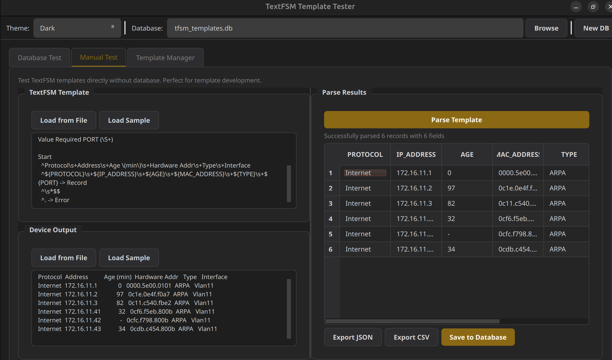

# TextFSM Fire - Automatic Template Matching Engine

## Overview

**tfsm_fire** is a Python library that automatically matches network device CLI output against a database of TextFSM templates. Rather than requiring you to know which template to use, the engine tests output against all candidate templates and returns the best match based on a multi-factor scoring algorithm.

This solves a real operational problem: when collecting data from hundreds of devices across dozens of vendors, manually mapping commands to templates doesn't scale. The engine handles the matching automatically.

## Architecture

```
┌─────────────────────────────────────────────────────────┐
│                   TextFSMAutoEngine                      │
├─────────────────────────────────────────────────────────┤
│  ┌─────────────────────┐    ┌────────────────────────┐  │
│  │ ThreadSafeConnection │    │  Template Scoring      │  │
│  │                     │    │                        │  │
│  │ - Thread-local DB   │    │ - Record count         │  │
│  │ - Connection pooling│    │ - Field richness       │  │
│  │ - Context manager   │    │ - Population rate      │  │
│  └─────────────────────┘    │ - Consistency          │  │
│                              └────────────────────────┘  │
├─────────────────────────────────────────────────────────┤
│                    tfsm_templates.db                     │
│  ┌─────────────────────────────────────────────────────┐ │
│  │ templates table:                                    │ │
│  │   id, cli_command, textfsm_content, textfsm_hash,  │ │
│  │   cli_content, source, created                      │ │
│  └─────────────────────────────────────────────────────┘ │
└─────────────────────────────────────────────────────────┘
```

## Components

### ThreadSafeConnection

Manages SQLite connections with thread-local storage. Essential for multi-threaded collection scenarios where multiple devices are being processed concurrently.

```python
class ThreadSafeConnection:
    def __init__(self, db_path: str, verbose: bool = False)
    
    @contextmanager
    def get_connection(self) -> sqlite3.Connection
        """Yields a thread-local database connection"""
    
    def close_all(self)
        """Closes connection for current thread"""
```

### TextFSMAutoEngine

The main engine class that handles template filtering, testing, and scoring.

```python
class TextFSMAutoEngine:
    def __init__(self, db_path: str, verbose: bool = False)
    
    def find_best_template(
        self, 
        device_output: str, 
        filter_string: Optional[str] = None
    ) -> Tuple[Optional[str], Optional[List[Dict]], float]
        """
        Returns: (template_name, parsed_data, score)
        """
    
    def get_filtered_templates(
        self, 
        connection: sqlite3.Connection, 
        filter_string: Optional[str] = None
    ) -> List[sqlite3.Row]
        """Returns templates matching the filter string"""
```

## Scoring Algorithm

The engine scores each template match on a 0-100 scale across four factors:

### Factor 1: Record Count (0-30 points)

Did the template successfully parse records from the output?

| Records | Score | Rationale |
|---------|-------|-----------|
| 0 | 0 | No match |
| 1-2 | 10-20 | Minimal match |
| 3-9 | 20-30 | Good match (diminishing returns) |
| 10+ | 30 | Full score |

**Version Command Exception:** Commands containing "version" expect exactly 1 record. Multiple records actually reduce the score.

### Factor 2: Field Richness (0-30 points)

How many fields does the template extract? More fields = richer structured data.

| Fields | Score | Quality |
|--------|-------|---------|
| 1-2 | 5-10 | Weak extraction |
| 3-5 | 10-20 | Decent |
| 6-9 | 20-30 | Good |
| 10+ | 30 | Excellent |

This factor prevents a template that only extracts an IP address from winning over one that extracts IP, MAC, interface, age, protocol, and type.

### Factor 3: Population Rate (0-25 points)

What percentage of parsed cells actually contain data?

```
population_score = (populated_cells / total_cells) * 25
```

A template that matches the structure but leaves most fields empty scores lower than one that populates all fields.

### Factor 4: Consistency (0-15 points)

Are the same fields populated across all records?

Templates that populate `INTERFACE` in some rows but not others score lower than templates with uniform field population. This catches templates that partially match the output format.

### Scoring Example

For `cisco_ios_show_arp` parsing 6 ARP entries with 6 fields each:

| Factor | Calculation | Score |
|--------|-------------|-------|
| Records | 6 records | 24.3 |
| Fields | 6 fields (ADDRESS, AGE_MIN, HARDWARE_ADDR, INTERFACE, PROTOCOL, TYPE) | 20.0 |
| Population | ~95% cells populated | 23.8 |
| Consistency | All fields consistently filled | 15.0 |
| **Total** | | **83.1** |

## Usage

### Basic Usage

```python
from tfsm_fire import TextFSMAutoEngine

engine = TextFSMAutoEngine("tfsm_templates.db", verbose=True)

# Raw CLI output from device
device_output = """
Protocol  Address      Age (min)  Hardware Addr   Type   Interface
Internet  172.16.10.1         0   0000.5e00.0101  ARPA   Vlan10
Internet  172.16.10.2        49   0caf.da85.dc95  ARPA   Vlan10
"""

# Find best matching template
template_name, parsed_data, score = engine.find_best_template(
    device_output, 
    filter_string="cisco_arp"
)

print(f"Best match: {template_name} (score: {score:.2f})")
for record in parsed_data:
    print(record)
```

### Filter String

The `filter_string` parameter narrows which templates to test. It splits on underscores and requires all terms to match:

```python
# Filter examples:
"cisco_ios"          # Templates containing "cisco" AND "ios"
"show_arp"           # Templates containing "show" AND "arp"  
"cisco_ios_show_arp" # All four terms must match
```

This dramatically reduces the search space from thousands of templates to a handful of candidates.

### Multi-threaded Usage

The engine is thread-safe for concurrent device collection:

```python
import threading
from tfsm_fire import TextFSMAutoEngine

engine = TextFSMAutoEngine("tfsm_templates.db")

def process_device(hostname, output, filter_str):
    template, data, score = engine.find_best_template(output, filter_str)
    print(f"{hostname}: {template} ({score:.1f})")

threads = []
for device in devices:
    t = threading.Thread(
        target=process_device,
        args=(device.hostname, device.output, device.command)
    )
    threads.append(t)
    t.start()

for t in threads:
    t.join()
```

## Database Schema

The engine expects a SQLite database with a `templates` table:

```sql
CREATE TABLE templates (
    id INTEGER PRIMARY KEY AUTOINCREMENT,
    cli_command TEXT NOT NULL UNIQUE,
    cli_content TEXT,
    textfsm_content TEXT NOT NULL,
    textfsm_hash TEXT,
    source TEXT,
    created TEXT
);

CREATE INDEX idx_cli_command ON templates(cli_command);
```

| Column | Description |
|--------|-------------|
| `cli_command` | Template identifier (e.g., `cisco_ios_show_ip_arp`) |
| `cli_content` | Original CLI command documentation (optional) |
| `textfsm_content` | The actual TextFSM template |
| `textfsm_hash` | MD5 hash for deduplication |
| `source` | Origin (e.g., `ntc-templates`, `custom`) |
| `created` | ISO timestamp |

## Integration with NTC-Templates

The engine works seamlessly with [ntc-templates](https://github.com/networktocode/ntc-templates). Import them using the companion GUI tool or directly:

```python
import sqlite3
import hashlib
from pathlib import Path
from datetime import datetime

def import_ntc_templates(ntc_dir: str, db_path: str):
    conn = sqlite3.connect(db_path)
    cursor = conn.cursor()
    
    for template_file in Path(ntc_dir).glob("**/*.textfsm"):
        content = template_file.read_text()
        cli_command = template_file.stem
        
        cursor.execute("""
            INSERT OR IGNORE INTO templates 
            (cli_command, textfsm_content, textfsm_hash, source, created)
            VALUES (?, ?, ?, ?, ?)
        """, (
            cli_command,
            content,
            hashlib.md5(content.encode()).hexdigest(),
            'ntc-templates',
            datetime.now().isoformat()
        ))
    
    conn.commit()
    conn.close()
```

## Dependencies

- Python 3.8+
- `textfsm` - Google's TextFSM library
- `click` - CLI output (optional, for verbose mode)

```bash
pip install textfsm click
```

## License

MIT

---

# TextFSM Fire Tester - Template Development & Management GUI

## Overview

**tfsm_fire_tester** is a PyQt6 GUI application for developing, testing, and managing TextFSM templates. It provides three integrated workflows:

1. **Database Test** - Test device output against your entire template database
2. **Manual Test** - Develop and debug templates without database interaction
3. **Template Manager** - Full CRUD operations on your template database

## Screenshots

### Database Test Tab
Test raw device output against all matching templates in your database. The engine scores each candidate and surfaces the best match.


### Manual Test Tab
Direct template development workflow. Paste a template and device output, see parsed results immediately. Perfect for iterating on regex patterns.



### Template Manager Tab
Browse, search, add, edit, and delete templates. Import from ntc-templates or export your custom templates.


## Features

### Database Test Tab

- **Filter String** - Narrow template search (e.g., `cisco_arp`, `juniper_bgp`)
- **Verbose Output** - See scoring details for each template tested
- **Best Results** - Shows winning template, score, and parsed data table
- **All Matching Templates** - Review all candidates that were tested
- **Debug Log** - Full engine output for troubleshooting
- **Template Content** - View the winning template's TextFSM definition

### Manual Test Tab

- **Load from File** - Import template or output from disk
- **Load Sample** - Quick-load test data for development
- **Parse Template** - Run TextFSM parser and display results
- **Export JSON/CSV** - Save parsed results
- **Save to Database** - Promote working template to your database

### Template Manager Tab

- **Search** - Filter templates by name
- **Add/Edit/Delete** - Full CRUD operations
- **Template Preview** - View TextFSM content for selected template
- **Import from NTC** - Bulk import from ntc-templates directory
- **Export All** - Export templates to individual `.textfsm` files
- **Duplicate** - Clone template for modification
- **Test in Manual** - Send template to Manual Test tab for debugging

## Installation

### As Part of VelocityCollector

The tester is integrated into VelocityCollector and accessible via **Tools → TextFSM Tester**.

```python
# In vcollector/ui/gui.py
def open_tfsm_tester(self):
    from vcollector.core.tfsm_fire_tester import TextFSMTester
    self.tfsm_window = TextFSMTester()
    self.tfsm_window.show()
```

### Standalone

```bash
python tfsm_fire_tester.py
```

## Usage Workflow

### Developing a New Template

1. **Manual Test Tab** - Paste sample device output
2. Write TextFSM template in the template editor
3. Click **Parse Template** to test
4. Iterate until all records parse correctly
5. Click **Save to Database** to persist

### Testing Template Coverage

1. **Database Test Tab** - Paste device output
2. Enter filter string (e.g., `cisco_ios_show`)
3. Enable **Verbose Output** for detailed scoring
4. Click **Test Against Database**
5. Review **Best Results** and **All Matching Templates**
6. If no good match, create new template in Manual Test

### Managing Templates

1. **Template Manager Tab** - Browse all templates
2. Use search to filter by command pattern
3. Select template to preview content
4. Edit templates that need regex fixes
5. Delete obsolete templates
6. Import new templates from ntc-templates updates

## Theme Support

Three built-in themes accessible from the toolbar:

- **Light** - Clean light background
- **Dark** - VS Code-inspired dark theme (default)
- **Cyber** - Terminal green aesthetic

## Database Location

Default: `tfsm_templates.db` in the current working directory.

Use **Browse** in the toolbar to select a different database, or **New DB** to create one.

## Keyboard Shortcuts

| Action | Shortcut |
|--------|----------|
| Parse (Manual Test) | `Ctrl+Enter` |
| Refresh templates | `F5` |
| Close | `Ctrl+Q` |

## Dependencies

- Python 3.8+
- PyQt6
- textfsm
- click (optional)

```bash
pip install PyQt6 textfsm click
```

## Integration Points

### With VelocityCollector

The tester shares the same `tfsm_templates.db` as the collection engine, so templates you develop are immediately available for automated collection jobs.

### With Secure Cartography

If `secure_cartography.tfsm_fire` is available, the engine imports from there for network discovery workflows.

## File Structure

```
vcollector/
├── core/
│   ├── tfsm_fire.py          # Engine library
│   └── tfsm_fire_tester.py   # GUI application
└── tfsm_templates.db          # Template database
```

## License

MIT

## Author

Scott Peterman